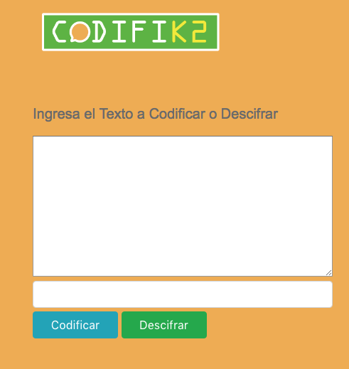
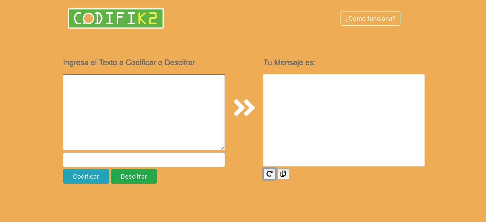

# Bienvenidos a CODIFIK2

En nuestra época de hiperconectividad, donde las comunicaciones se extienden en muchas plataformas y medios. La mensajería se sitúa como el primer canal de comunicación superando a las llamadas telefónicas.

 **CODIFIK2**  nace entendiendo este escenario para brindar una herramienta que permita comunicarnos libremente por cualquier canal de mensajería sin tener temor a ser descubiertos.

¿Descubiertos? 
Si, para todas esas personas que quieren mantener la discreción, organizar un evento sorpresa, encontrarse con alguien en especial o simplemente destacarse frente a los demás como únicos.  **CODIFIK2** es una vía confiable y segura para poder pasarlo bien sin preocuparse de los demás.

## Usuarios de CODIFIK2

La característica principal de un usuario de CODIFIK2, esta en la búsqueda de mensajería de vanguardia, formas nuevas y entretenidas de comunicación.
 El objetivo principal es que estos usuarios tengan una app funcional para ayudarlos en momentos en que necesiten de mantener alguna información oculta y quieran compartirla solo con algunas personas que ellos decidan. 

Un grupo de amigos están organizando la despedida de soltero de uno de ellos, pero no quieren que sus parejas se enteren de lo que tienen preparado, por lo tanto, recurren a  **CODIFIK2** para enviar la información más detallada de lo que les espera en esta fiesta, solo el grupo de amigos  tendrá la información confidencial.

## Mensaje Confidencial

La principal misión de nuestra aplicación web es que los usuarios tengan la tranquilidad de que su mensaje solo será entendible por quien ellos elijan, además que nuestro sistema de número secreto hará más seguro y personal el texto.

## ¿Como funciona CODIFIK2?

Nuestra Aplicación web está basada en el  **Cifrado Cesar** . Es un tipo de cifrado por sustitución en el que una letra en el texto original es reemplazada por otra letra que se encuentra en posiciones más adelante en el alfabeto. Por ejemplo, con un desplazamiento de 3, la A sería sustituida por la D (situada 3 lugares a la derecha de la A), la B sería reemplazada por la E, etc. Este método debe su nombre a Julio César, que lo usaba para comunicarse con sus generales.

Con **CODIFIK2** el usuario tiene el poder de elegir cómo quiere codificar el texto, escogiendo un número el cual podrá mantener en secreto, creando así un mensaje más confidencial. Este mensaje solo lo entenderá la persona que reciba el texto junto al número secreto.

## Instrucciones de Uso

 **CODIFIK2** es un sistema que utiliza el cifrado césar, una codificación  que va desplazando las letras para crear un mensaje ilegible para los demás. 
     *"Aunque  todos lo puedan leer, solo tu decides quien los entiende"*

- Debes ingresar el texto que quieres que se codifique. 
(Recuerda que solo debes ingresar letras sin caracteres especiales, la letra Ñ debes escribirla como N. )
- Una vez ingresado tu texto, comienza la magia. 
- Para que este texto sea más personalizado y lo entiendan tú junto a la persona a quien quieres compartir, también debes ingresar un número que quieras asi este texto lo entenderan solo quienes tú decidas.
(Recuerda que al compartir el texto, también tienes que adjuntar el número secreto)
 - Después de elegir el número para desplazar, haz click en codificar y tu mensaje estará listo para compartir. 
- Para Descifrar tienes que ingresar el texto que te fue enviado junto al  número secreto y dar click en Descifrar. ...LISTO!!!! 
                   *Tú mensaje secreto habra sido descifrado!!!!*
                   

#### Proceso de Desarrollo y Diseño 
Planificacion realizada a través de sistema Trello.
https://trello.com/b/3m3oYMNN/cifrado-cesar

Se desarrollo un estudio de usuarios y usabilidad, donde se realizaron pruebas para ver si
nuestra aplicacion estaba pensada en la experiencia de Usuario.

Proceso de Diseño realizado con el concepto minimalista y funcional, poner en pantalla lo que realmente sirve para el usuario con demasiada informacion.

Se utilizaron colores amigables y alegres como el naranjo y verde.

#### Interfaz de usuario (UI)

La interfaz debe permitir al usuario:

- Elegir un desplazamiento (_offset_) indicando cuántas posiciones queremos que el cifrado desplace cada caracter.
- Insertar un mensaje (texto) que queremos cifrar.
- Ver el resultado del mensaje cifrado.
- Insertar un mensaje (texto) a descifrar.
- Ver el resultado del mensaje descifrado.

